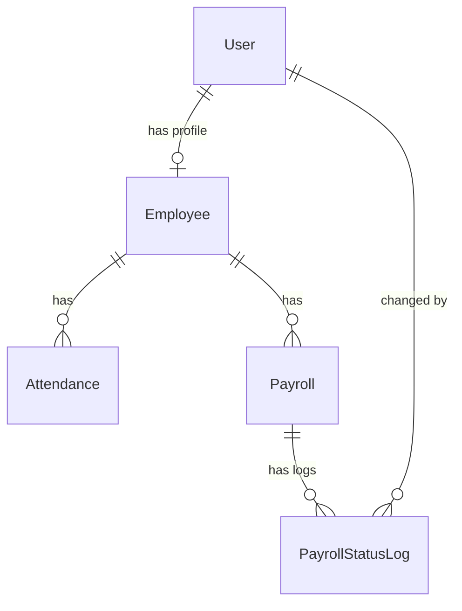

# Database Schema

## Employee Model
| Field | Type | Constraints |
|-------|------|-------------|
| id | AutoField | PK |
| user | FK(User) | nullable |
| first_name | CharField(50) | required |
| last_name | CharField(50) | required |
| employee_id | CharField(20) | unique |
| gender | CharField(10) | choices |
| date_of_birth | DateField | nullable |
| email | EmailField | unique |
| phone | CharField(15) | required |
| address | TextField | nullable |
| department | CharField(100) | required |
| designation | CharField(100) | required |
| date_of_joining | DateField | required |
| basic_salary | Decimal(10,2) | default=5000 |
| is_active | Boolean | default=True |
| role | CharField(20) | choices: admin/employee |
| invitation_token | CharField(64) | nullable |
| token_expires | DateTime | nullable |

## Attendance Model
| Field | Type | Constraints |
|-------|------|-------------|
| id | AutoField | PK |
| employee | FK(Employee) | required |
| date | DateField | default=today |
| check_in | TimeField | nullable |
| check_out | TimeField | nullable |
| status | CharField(20) | choices |
| working_hours | CharField(20) | nullable |
| working_hours_decimal | Decimal(5,2) | default=0 |

**Unique Together:** (employee, date)

**Status Choices:** Present, Absent, On Leave, Late, Half Day, Working

## Payroll Model
| Field | Type | Constraints |
|-------|------|-------------|
| id | AutoField | PK |
| employee | FK(Employee) | required |
| basic_salary | Decimal(10,2) | required |
| allowances | Decimal(10,2) | default=0 |
| deductions | Decimal(10,2) | default=0 |
| net_salary | Decimal(10,2) | auto-calculated |
| status | CharField(20) | choices: Paid/Pending |
| pay_date | DateField | default=now |
| payroll_month | Integer | required |
| payroll_year | Integer | required |

**Unique Together:** (employee, payroll_month, payroll_year)

## PayrollStatusLog Model (New)
| Field | Type | Constraints |
|-------|------|-------------|
| id | AutoField | PK |
| payroll | FK(Payroll) | required |
| old_status | CharField(20) | required |
| new_status | CharField(20) | required |
| changed_by | FK(User) | nullable |
| changed_at | DateTime | auto |
| notes | TextField | nullable |

---

